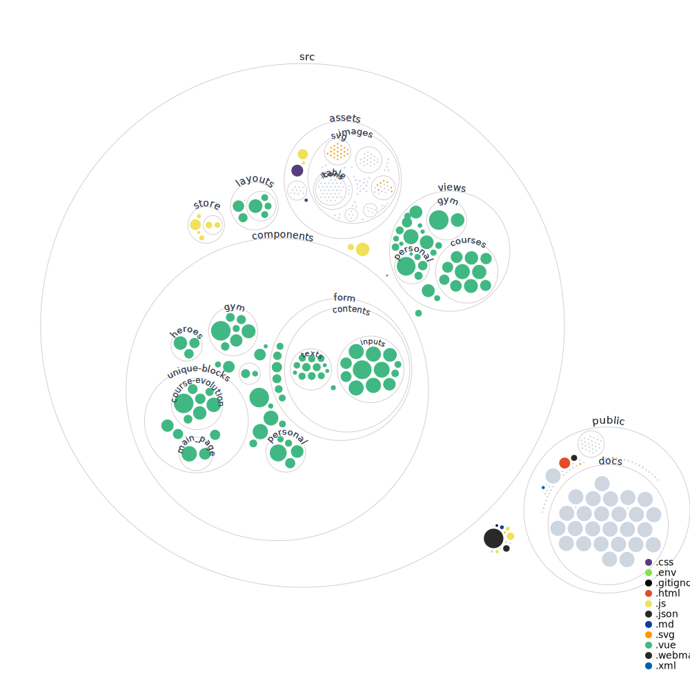

Sektaschool project (Frontend part - SPA)

# sekta



## Project setup
```
npm install
```

### Compiles and hot-reloads for development
```
npm run serve
```
or GUI with [@vue/cli](https://cli.vuejs.org/guide/)
```
vue ui
```

### Compiles and minifies for production
```
npm run build
```

### Run your tests
```
npm run test
```

### Lints and fixes files
```
npm run lint
```

### Customize configuration
See [Configuration Reference](https://cli.vuejs.org/config/).
